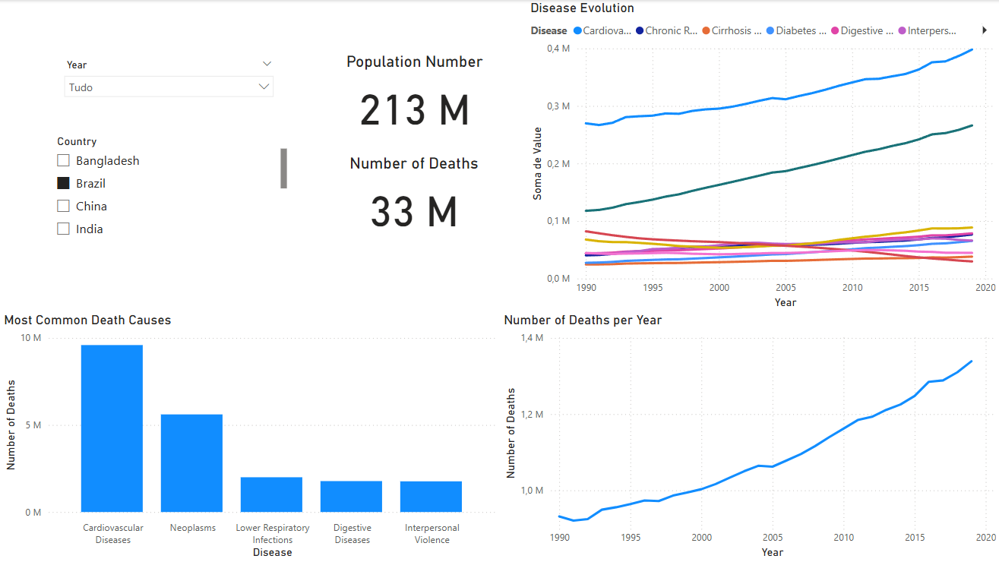

# Death Causes Dashboard

## Overview
This project focuses on developing a comprehensive Power BI dashboard to explore and analyze causes of death worldwide. By leveraging advanced data visualization techniques, the dashboard transforms raw data into meaningful insights. The goal is to empower users to understand trends, make data-driven decisions, and spark discussions around global health issues.

---

## Dashboard Image

---

## Features
- **Interactive Visualizations**: Navigate through various dimensions such as age groups, regions, and time periods.
- **Insightful Metrics**: Includes calculated key performance indicators (KPIs) for better understanding trends.
- **User-Friendly Interface**: Easy-to-use layout for exploring the data.

---

## Technologies Used
- **Power BI**: The primary platform for building the dashboard and creating impactful visualizations.
- **Power Query**: Used for cleaning, transforming, and preparing data for analysis.
- **DAX (Data Analysis Expressions)**: Enabled advanced calculations and created measures for in-depth analysis.

---

## Data Sources
- **countries.json**: This dataset serves as the primary source of country-specific information that is integrated into the analysis.

---

## ETL Processes Applied
1. **Data Import and Cleaning**: 
   - The raw data was imported using Power Query, where null values, duplicates, and inconsistencies were resolved.
2. **Data Transformation**: 
   - Power Query was utilized to reshape the data into a structured format suitable for analysis.
3. **Enrichment and Calculations**: 
   - Leveraged **DAX** for creating calculated fields, measures, and performing aggregations.
4. **Integration**:
   - Merged the `countries.json` data with other datasets to enrich the analysis and provide geographic insights.

---

## Output
The final product is a Power BI file (`death_causes.pbix`), which contains:
- A fully interactive dashboard with visualizations and metrics tailored for analyzing causes of death.
- Insights that allow users to explore data trends and patterns.

---

## How to Use
1. Open the `death_causes.pbix` file in Power BI Desktop.
2. Interact with the dashboard by exploring filters, slicers, and visualizations.
3. Gain insights and analyze trends based on the provided data.

---

## Future Improvements
- Incorporate additional datasets to provide more comprehensive analysis.
- Enhance visualizations with more custom visuals and advanced formatting.
- Implement dynamic updates to keep the dashboard current with real-world trends.

---

Feel free to suggest any edits or let me know if you'd like further improvements. Happy analyzing! 🎉
